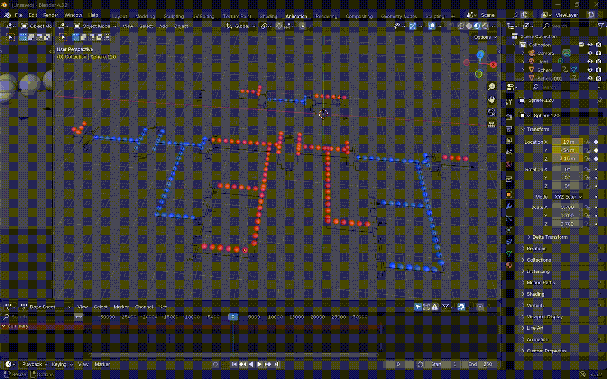

# 3D Circuit Simulation Visualizer

This project aims to create visual representations of voltage propogating through analog circuits.

## Demonstration

Here is a SKY130 Flip-Flop being simulated. You can see the two latches being updated with clock signal on the top.



## Dependencies

* Blender
    ```bash
    sudo snap install blender --classic
    ```
* ngspice
    * Installation instructions: <https://github.com/sifferman/sky130_schematics/blob/7aa3f386/.github/workflows/build-and-release.yml#L40-L55>
* Xschem
    * Installaion instructions: <https://github.com/sifferman/sky130_schematics/blob/7aa3f386/.github/workflows/build-and-release.yml#L60-L64>
* SKY130 PDK Via Ciel
    ```bash
    python3 -m venv ciel-venv
    ciel-venv/bin/python3 -m pip install --upgrade --no-cache-dir ciel
    export PDK_ROOT=$TOOLS/ciel-pdks
    ciel-venv/bin/ciel enable --pdk sky130 0fe599b2afb6708d281543108caf8310912f54af
    ```

## Running

```bash
python3 xschem3d.py
blender --python blender_animate.py -- build/Xschem3D/be88ce475a3a490f044f945f3d0f1ea09dbef51c6a5db211dc6baa131c44efe8/coordinate_voltages.json build/Xschem3D/be88ce475a3a490f044f945f3d0f1ea09dbef51c6a5db211dc6baa131c44efe8/sky130_fd_sc_hd__dfxtp_1.svg
```
