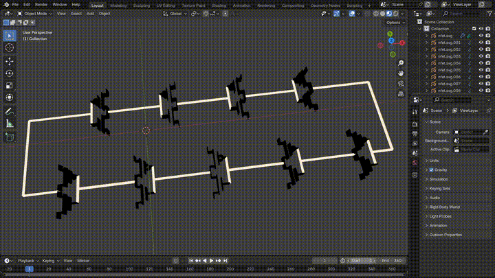
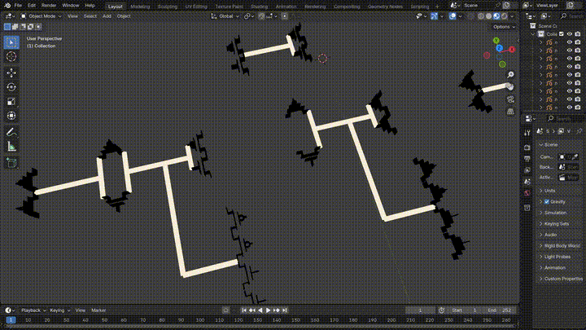

# 3D Circuit Simulation Visualizer

This project aims to create visual representations of voltage propogating through analog circuits. It uses Ngspice, Xschem, and Blender.

## Demonstration

Here is a Ring Oscillator being simulated. You can see the voltage propagate through each of the inverters. When a wire has a voltage, it gets bigger; when a FET has current, it turns red.



Here is a D-Flip-Flop being simulated. You can see the voltage propagate as the clock changes.



## Dependencies

* Blender
    ```bash
    sudo snap install blender --classic
    ```
* ngspice
    * Installation instructions: <https://github.com/sifferman/sky130_schematics/blob/7aa3f386/.github/workflows/build-and-release.yml#L40-L55>
* Xschem
    * Installaion instructions: <https://github.com/sifferman/sky130_schematics/blob/7aa3f386/.github/workflows/build-and-release.yml#L60-L64>
* SKY130 PDK Via Ciel
    ```bash
    python3 -m venv ciel-venv
    ciel-venv/bin/python3 -m pip install --upgrade --no-cache-dir ciel
    export PDK_ROOT=$TOOLS/ciel-pdks
    ciel-venv/bin/ciel enable --pdk sky130 0fe599b2afb6708d281543108caf8310912f54af
    ```

## Running

```bash
# Open schematics with
xschem --rcfile $PDK_ROOT/sky130A/libs.tech/xschem/xschemrc examples/dfxtp/sky130_fd_sc_hd__dfxtp_1.sch
xschem --rcfile $PDK_ROOT/sky130A/libs.tech/xschem/xschemrc examples/ro/ro.sch

# Run ring oscillator example with
python3 xschem3d.py examples/ro/ro.sch examples/ro/ro.stim build.ro
blender --python blender_animate.py -- build.ro/circuit.json

# Run DFF example with
python3 xschem3d.py examples/dfxtp/sky130_fd_sc_hd__dfxtp_1.sch examples/dfxtp/sky130_fd_sc_hd__dfxtp_1.stim build.dfxtp
blender --python blender_animate.py -- build.dfxtp/circuit.json
```
